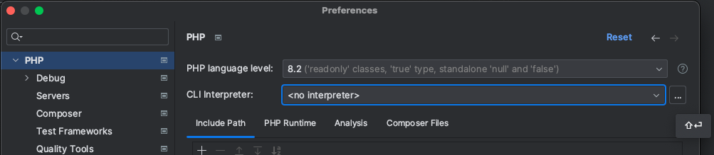
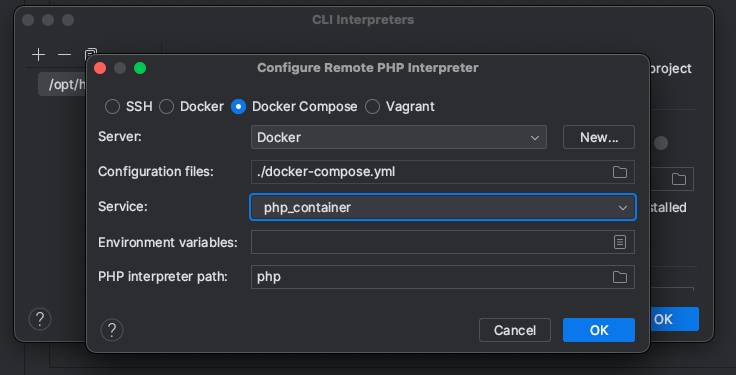
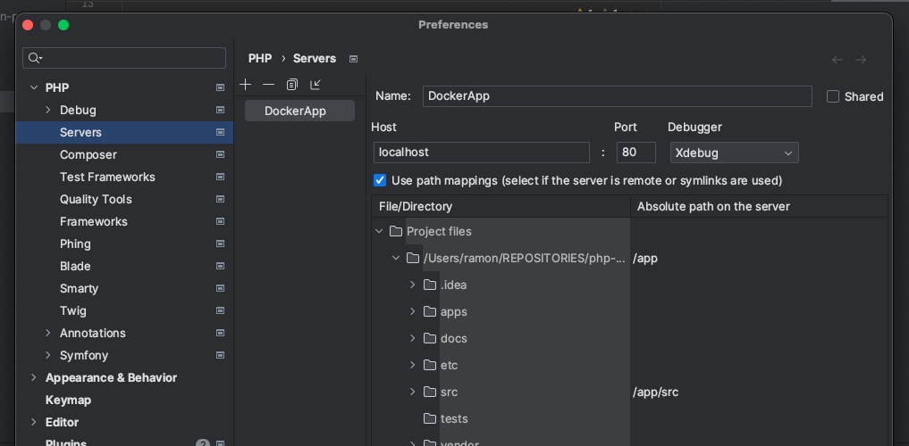

# Table of contents
1. [Installation](#installation)
   1. [Checking the installation](#checking-the-installation)
   2. [Enabling xDebug in your phpStorm](#enabling-xdebug-in-your-phpstorm)
2. [Usage](#usage)

## Installation 
Run `make build` in order to install all the application dependencies (make sure you have Docker running on your system).

For more available commands, type `make help`.

--> Once the app is installed, you can use `make start` instead of `make build`.

### Checking the installation 
Simply go to http://localhost:8000/health : you should get a `200: Okay` response from the server

### Enabling `xDebug` in your phpStorm 
1. Go to **Preferences -> PHP** and select **PHP 8.2** version

2. Click on `...` to create a CLI interpreter
    

3. Create the CLI interpreter by selecting the following parameters:
- Type: Docker compose
- Server: `Docker`
- Configuration files: `./docker-compose.yml`
- Service: `php_container`  
  

4. Go to **Preferences -> PHP -> Debug -> Servers** to create a new one:
- Name: `DockerApp`
- Host: `localhost` (Port and Debugger should automagically be detected)
- Make sure you check the `Use path mappings` options
- Map the folders to the ones that belong to the Docker container
    - **PROJECT_DIR**: should be mapped to `app`
    - **src**: should be mapped to `app/src`
      

## Usage 
To be defined...
